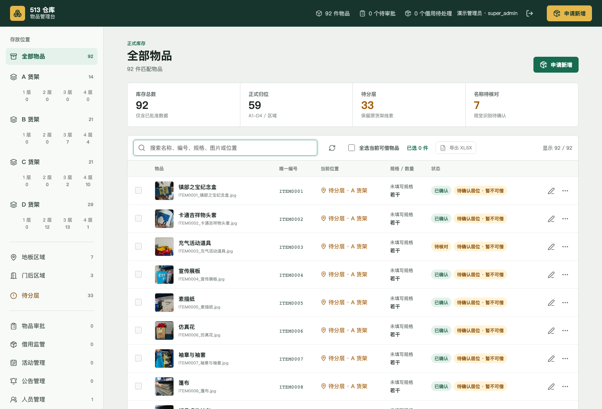
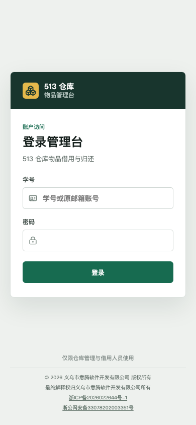
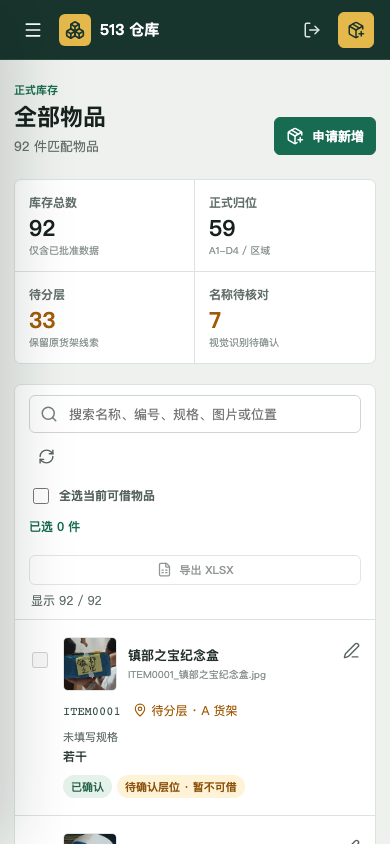
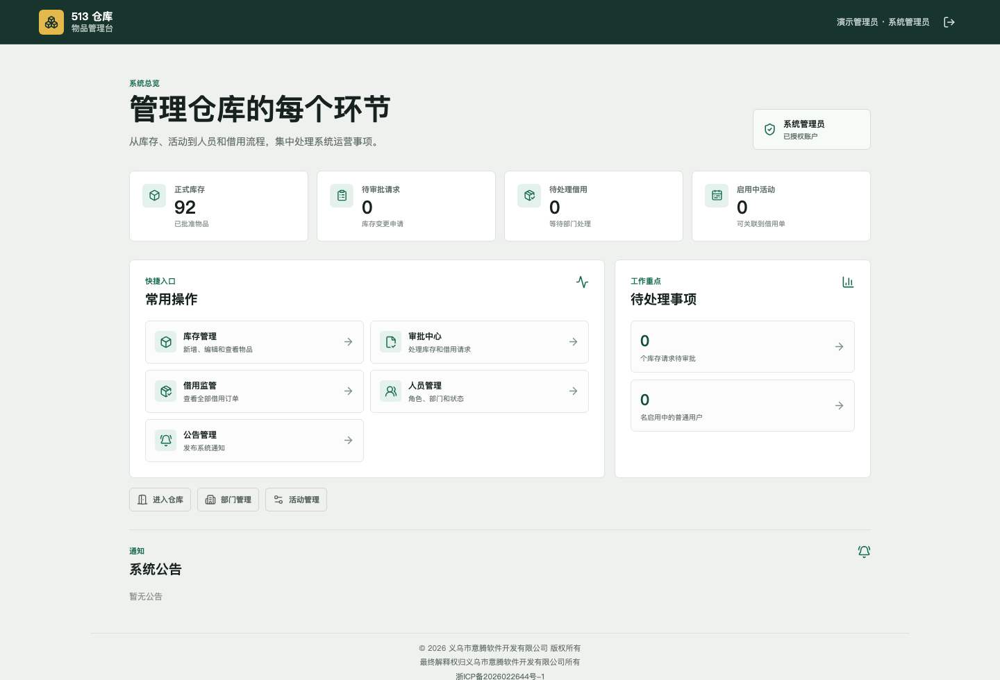
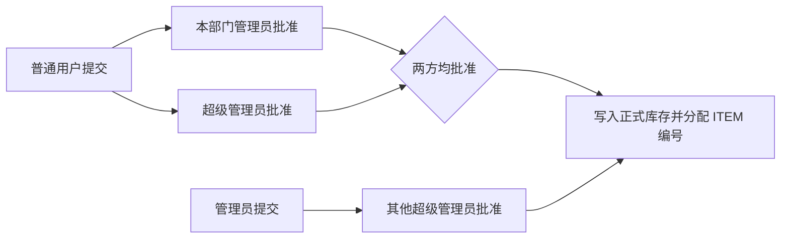
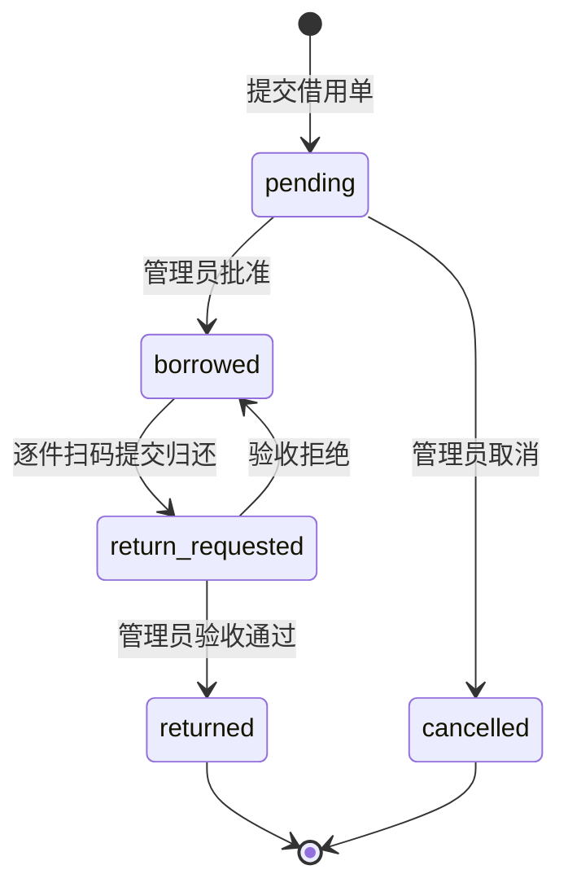

<div align="center">
  <h1>513 仓库管理系统</h1>
  <strong>绿色线上版 · 移动端友好 · 学号登录 · 扫码归还</strong><br />
  <br />
  <a href="https://lzmyselfai.cn/513base/">打开生产站点</a> ·
  <a href="#快速开始">本地开发</a> ·
  <a href="docs/WORKFLOWS.md">业务流程</a> ·
  <a href="deploy/README.md">部署指南</a>
</div>

面向武汉纺织大学外经贸学院信息技术学部的仓库物品借用平台。系统把库存、位置、审批、借用、扫码归还、代还和人员管理放在同一个移动端友好的 Web 应用中，使用学号登录，适合在校园内通过手机完成现场操作。

生产站点：<https://lzmyselfai.cn/513base/>  ·  [登录](https://lzmyselfai.cn/513base/login)  ·  [管理台](https://lzmyselfai.cn/513base/app)

> 当前版本保留绿色线上界面，生产部署使用 `/513base/` 子路径。完整的开发、数据库初始化和发布说明分别见 [开发与环境准备](docs/GETTING_STARTED.md)、[业务流程](docs/WORKFLOWS.md)、[云端部署](deploy/README.md) 和 [交接记录](HANDOFF.md)。

**技术栈**：React · TypeScript · Vite · Supabase Auth · PostgreSQL / RLS · Supabase Edge Functions

## 界面预览

真实绿色界面，截图使用仓库自带的初始库存与匿名演示账号，不包含线上人员资料或真实订单。



<table>
  <tr>
    <th align="center">手机 · 学号登录</th>
    <th align="center">手机 · 库存浏览</th>
  </tr>
  <tr>
    <td align="center"></td>
    <td align="center"></td>
  </tr>
</table>

<details>
  <summary>查看角色工作台</summary>
  <br />
  
</details>

## 文档导航

| 任务 | 入口 |
| --- | --- |
| 安装、环境变量、空开发库初始化 | [开发与环境准备](docs/GETTING_STARTED.md) |
| 角色边界、新增审批、借用与扫码归还 | [业务流程](docs/WORKFLOWS.md) |
| 子路径部署、发布、验收与回退 | [云端部署](deploy/README.md) |
| Excel 模板、二维码和资料生成 | [工具说明](tools/README.md) |
| 当前状态、历史验收与接手事项 | [交接记录](HANDOFF.md) |

## 能做什么

- 以 `ITEMxxxx` 作为稳定物品编号，记录名称、规格、数量、图片和实际位置。
- 用 `super_admin`、`admin`、`member` 三层身份控制后台权限，数据库 RLS 和受控 RPC 是最终权限边界。
- 三类身份都能提交新增物品申请；普通用户的申请需要本部门管理员和超级管理员分别批准，管理员申请需要超级管理员批准，申请人不能自批。必需审批全部通过后才会进入正式库存。
- 三类身份都能发起借用。审批通过后立即进入“借出中”，不需要再点击一次借出按钮；管理员不能审批自己的借用。
- 归还时逐件扫描借出前位置对应的二维码，管理员验收后才完成归还。借用人可以指定已启用的同学代还，责任仍归原借用人。
- 超级管理员可以使用 Excel 模板批量导入部门、姓名、手机号、学号和身份，新账号首次登录必须改密。
- 提供活动、公告、位置历史、操作日志、图片上传、借用状态和移动端抽屉导航。

## 角色权限

| 能力 | 普通用户 `member` | 部门管理员 `admin` | 超级管理员 `super_admin` |
| --- | --- | --- | --- |
| 查看正式库存、提交新增和借用 | 可以 | 可以 | 可以 |
| 审批新增物品 | 无 | 本部门普通用户的部门审批 | 全部超级管理员审批 |
| 修改、删除库存 | 无 | 提交变更申请 | 维护正式库存并处理审批 |
| 审批借用和归还 | 无 | 本部门普通用户订单 | 全部部门订单 |
| 管理人员和部门 | 无 | 本部门普通用户资料 | 全部人员、身份和部门 |
| 管理活动 | 无 | 本部门活动 | 全部部门及全局活动 |
| Excel 人员导入、公告和部门管理 | 无 | 无 | 可以 |

超级管理员本人提交的申请必须由另一名超级管理员处理。普通管理员可以借用，也可以提交新增申请，但不能审批自己的申请。

## 两条核心流程

### 新增物品



审批记录和正式库存分开保存。任何必需审批被拒绝，申请都不会上架；数据库已关闭绕过审批直接新增正式库存的权限。

### 借用与归还



借用可批量勾选物品并关联活动。系统记录借出时的具体位置；归还必须使用位置二维码 `513-warehouse:A1` 这类完整 payload 逐件验证。二维码套装位于 [`artifacts/qr/513base-二维码标识套装.pdf`](artifacts/qr/513base-二维码标识套装.pdf)，包含登录入口、A1-D4、`FLOOR` 和 `DOOR` 共 19 张标识。二维码验证位置内容，最终归位仍由管理员验收。

代还流程是：原借用人按学号指定一名已启用同学，代还人登录自己的账号逐件扫码提交，管理员验收。系统分别记录原借用人、实际提交人和审核人，订单责任不转移。

## 位置规则

| 位置 | 含义 |
| --- | --- |
| `A1`–`A4`、`B1`–`B4`、`C1`–`C4`、`D1`–`D4` | 四组货架的具体层位，可借用、可扫码归还 |
| `FLOOR`、`DOOR` | 地板、门后，可借用、可扫码归还 |
| `PENDING_A`–`PENDING_D` | 只确认货架、尚未确认层位，完成盘点前不可借用 |

不要把 `PENDING_*` 改成虚构的 `A0`、`B0`、`C0` 或 `D0`。

## 快速开始

需要 Node.js 22+ 和 npm：

```bash
git clone https://github.com/LoveZMyself11/513_warehouse_code.git
cd 513_warehouse_code
npm ci
cp .env.example .env.local
```

在 `.env.local` 中填写目标 Supabase 项目的浏览器安全变量，然后启动开发服务器：

```dotenv
VITE_SUPABASE_URL=https://your-project-ref.supabase.co
VITE_SUPABASE_PUBLISHABLE_KEY=sb_publishable_...
```

```bash
npm run dev
```

开发环境使用 `/login`、`/app`；生产构建使用 `/513base/login`、`/513base/app`。运行检查和构建：

```bash
npm run typecheck
npm run test:auth-storage
npm run check
npm run preview
```

`VITE_` 变量会进入浏览器构建产物，只能放 publishable key；不要把 secret 或 `service_role` key 放入前端、`.env.example` 或 Git。

## Supabase 初始化

已经上线的项目不要重跑基础 SQL 或 `seed.sql`。独立空开发库按以下顺序执行：

1. `supabase/schema_v2.sql`
2. `supabase/seed.sql`（可选，仅用于空开发库的 92 项样本库存）
3. `supabase/auth_and_rls.sql`
4. `supabase/inventory_workflow.sql`
5. `supabase/storage_images.sql`
6. 按文件名顺序执行 `supabase/migrations/` 下的七条迁移
7. `supabase/verify_setup.sql`（只读检查）

七条迁移依次覆盖活动与批量借用、归还验收、公告与二维码、双重审批与代还、学号登录与账号导入、具体位置约束，以及关闭直接新增库存的旁路。三个 Edge Functions 为 `student-login`、`import-accounts`、`change-initial-password`，部署方法见 [开发与环境准备](docs/GETTING_STARTED.md)。

## Excel 人员导入

正式模板：[`public/templates/account_import_template.xlsx`](public/templates/account_import_template.xlsx)。超级管理员在人员管理中上传 `.xlsx` 文件，系统会预览并逐行校验部门、姓名、手机号、学号、身份、邮箱、职位和备注。

- 单文件不超过 5 MB，最多 500 人；重复学号或已存在账号不会覆盖原资料。
- 不存在的部门会自动建立；导入账号使用统一初始密码，首次登录必须改成新的强密码。
- 不要把填写后的人员表、账号凭据或包含个人信息的导入结果提交到 GitHub。

模板交付副本与生成脚本见 [`artifacts/account-import/`](artifacts/account-import/) 和 [`tools/create_student_account_template.mjs`](tools/create_student_account_template.mjs)。

## 项目结构

```text
src/
├── pages/       # DashboardPage、InventoryPage 页面级业务编排
├── auth/        # session、学号登录、首次改密、受保护路由
├── components/  # 导入、开发者联系、备案底标等复用组件
├── lib/         # Supabase 客户端和静态资源 URL 处理
├── locations.ts # 货架位置和二维码解析
├── types.ts     # 前端业务类型
└── styles/      # main.css 应用样式
data/            # 92 项历史物品图片，随静态构建发布
fixtures/        # 初始库存导出和图片映射，不是在线库存备份
supabase/        # 基础 SQL、迁移、Edge Functions 和回归脚本
tools/           # 可复用工具；历史脚本位于 tools/legacy/
artifacts/       # Excel 模板、二维码套装和历史交付物
docs/            # 入门、业务流程和历史文档
deploy/          # Nginx、静态发布和回退脚本
```

历史微信解析、库存重命名和旧模板工具只用于离线资料准备，说明见 [`tools/README.md`](tools/README.md)。库存生成器会把数量重新写为“若干”，不能用来覆盖在线盘点数据。

## 数据与图片

当前初始库存为 92 项，编号 `ITEM0001`–`ITEM0092`。其中仍有 33 项待确认具体层位、7 项名称待人工复核、2 项为区域总览照片，初始数量多数只是“若干”。在线业务数据以 Supabase 为准；`fixtures/inventory/` 仅保存初始化资料。

历史图片来自仓库内 `data/`，数据库中的 `/data/...` 路径由前端按站点基路径解析；新增或替换图片使用公开的 `inventory-images` Storage，归还照片使用私有的 `borrow-return-images` Storage。

## 部署与验收

静态站点部署不需要 Node 常驻进程，只需要现有服务器的 Nginx。发布脚本会执行类型检查、构建、上传独立 release、原子切换 symlink，并在失败时回退。详见 [`deploy/README.md`](deploy/README.md)。

2026-10-07 的功能验收已覆盖三类角色审批、借用、二维码归还、代还和 Excel 模板；生产 smoke 覆盖桌面/手机视口下的登录、路由刷新、工作台和库存图片。2026-10-08 的目录整理通过 `npm run check`，并用匿名样本完成浏览器搜索、移动端侧栏、图片加载、页面溢出和未登录跳转检查。登录存储与上传超时的回归测试可运行 `npm run test:auth-storage`。

真实手机摄像头、相册选择和移动网络仍需在目标设备补验；项目目前没有 lint、CI 或入库的端到端浏览器测试。

## 维护者与支持

开发者：李在明（Love_ZMyself），计算机应用技术 2406 班。

GitHub：<https://github.com/LoveZMyself11/513_warehouse_code>

遇到技术问题，建议发送邮件工单至 `lovezmyself0511@gmail.com`，写明“部门 + 姓名 + 发生了什么 + 复现步骤”，并附截图。也可以联系 WeChat：`Love_ZMyself`，QQ：`2944095143`。

> 平静 坚毅 不流泪

## 版权与备案

浙ICP备2026022644号-1<br>
浙公网安备33078202003351号<br>
最终解释权归义乌市意腾软件开发有限公司所有<br>
2026 版权所有

仓库未附带 MIT 或其他开源许可证声明；公开代码不等同于授予未确认的开源许可。
