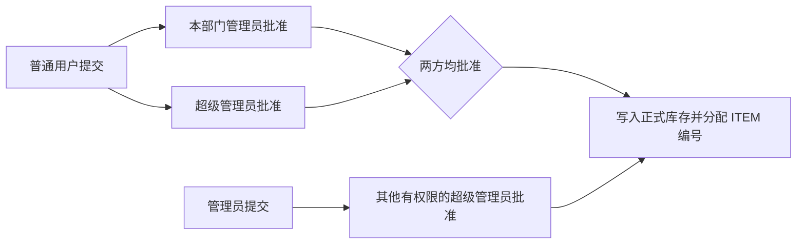
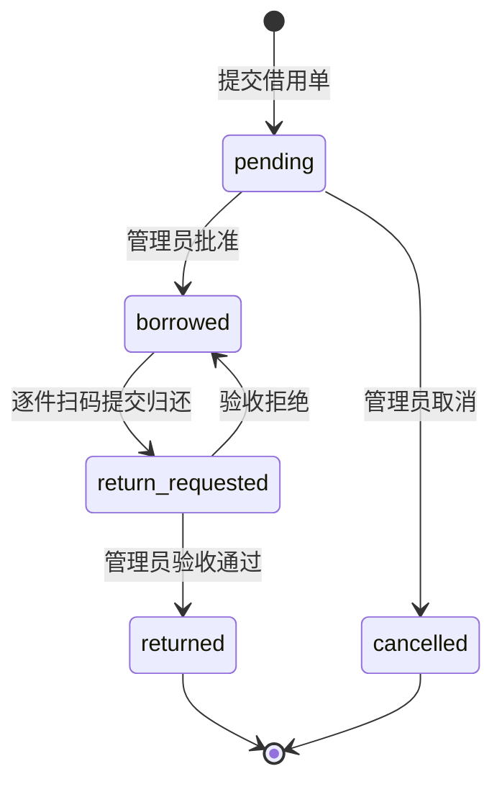

# 角色与业务流程

[返回项目首页](../README.md) · [开发与环境准备](GETTING_STARTED.md) · [打印二维码](../artifacts/qr/513base-二维码标识套装.pdf) · [账号模板](../public/templates/account_import_template.xlsx)

本页描述当前正式流程。身份与部门来自 `public.users`，权限由数据库 RLS、受控 RPC 和账户服务执行；前端页面按这些权限展示操作。

## 1. 三类身份

| 能力 | 普通用户 `member` | 部门管理员 `admin` | 超级管理员 `super_admin` |
| --- | --- | --- | --- |
| 查看正式库存、发起新增与借用 | 可以 | 可以 | 可以 |
| 新增申请审批 | 无 | 本部门普通用户的部门审批 | 全部申请的超级管理员审批 |
| 修改、删除库存 | 无 | 提交变更申请 | 维护正式库存并处理变更申请 |
| 借用、归还审批 | 无 | 本部门普通用户订单 | 全部部门订单 |
| 活动管理（创建、编辑、删除） | 无 | 本部门活动 | 全部活动 |
| 维护人员 | 无 | 本部门普通用户资料与启用状态 | 全部人员、身份、部门与启用状态 |
| Excel 导入、部门与公告管理 | 无 | 无 | 可以 |
| 提交本人或被委托订单的归还 | 可以 | 可以 | 可以 |

管理员不能审核自己发起的新增、借用，或自己借用及自己提交的归还申请。部门管理员本人的申请由超级管理员处理；超级管理员本人的申请需要另一名超级管理员处理。

普通用户不能创建或维护活动，但可在借用单中选择当前可用的活动。部门管理员可维护本部门活动，超级管理员可维护所有部门及全局活动。

## 2. 登录与账号生命周期

1. 超级管理员导入或启用账号，分配身份和部门。
2. 成员使用学号与密码登录。学号去除首尾空格并统一转成小写；规范化后的学号唯一。
3. 新导入账号先设置新密码，再进入角色工作台。密码长度为 10 至 128 位，须同时包含字母与数字，不能继续使用统一初始密码。
4. 登录后可以进入库存与业务管理台；停用、未关联业务资料的账号会被拦截。

学号只是同一 Supabase Auth 账号的登录查找字段，不会另建一套 session。原有邮箱登录保留兼容。首次改密门禁同时在页面和数据库执行。

## 3. 物品新增与上架

三个身份都先提交新增申请；提交申请不会立即进入正式库存。

| 申请人 | 必须完成的审批 | 上架条件 |
| --- | --- | --- |
| 普通用户 | 本部门管理员与超级管理员各审批一次 | 两方均批准 |
| 部门管理员 | 超级管理员审批 | 批准，申请人不得自批 |
| 超级管理员 | 另一名超级管理员审批 | 批准，申请人不得自批 |

普通用户必须已分配部门才能提交新增。部门管理员和超级管理员同时能看到待审批申请，两方的审批没有固定先后顺序；只完成其中一方时，申请仍为待审批。任何必需审批被拒绝，申请即被拒绝，不会上架。

最终审批由 RPC 将申请写入 `inventory_items`，数据库分配稳定且不重复使用的 `ITEMxxxx` 编号。物品改名、移动位置不会改变编号。新增的直接插表与创建 RPC 旁路已被关闭，超级管理员也遵循新增审批。

现有物品的修改与删除仍按身份处理：部门管理员提交变更请求，超级管理员审批；超级管理员可以直接维护正式库存。

## 4. 借用申请与借出

三个身份都可以勾选可借物品。勾选后主操作变为“填写借用单”，填写借用理由、预计归还日期和数量，可关联启用中的活动。

| 借用人 | 审批人 |
| --- | --- |
| 普通用户 | 本部门管理员或超级管理员，任一有权限审批通过即可 |
| 部门管理员 | 超级管理员 |
| 超级管理员 | 另一名超级管理员 |

借用审批不要求双重确认。审批通过后直接进入 `borrowed`（借出中），记录数据库借出时间和各物品借出时位置，库存列表同步显示借出状态。管理员无需再点一次“借出”。

`approved` 是保留的兼容状态；当前审批会直接转为 `borrowed`。已有活跃订单的物品由数据库拒绝重复借用。库存中的数量描述与借用单的整数数量分别保存，初始“若干”不能视为精确盘点数量。

## 5. 位置与二维码归还

| 位置 | 编码 | 是否支持借出与扫码归还 |
| --- | --- | --- |
| A 至 D 货架，每架四层 | `A1`–`A4`、`B1`–`B4`、`C1`–`C4`、`D1`–`D4` | 支持 |
| 地板 | `FLOOR` | 支持 |
| 门后 | `DOOR` | 支持 |
| 只确认货架，尚未确认层位 | `PENDING_A`、`PENDING_B`、`PENDING_C`、`PENDING_D` | 先确认具体位置 |

待分层是盘点工作队列，不是第 0 层货架。待分层物品不能发起或批准借出；管理员完成实际层位确认后才可借用。

[二维码套装](../artifacts/qr/513base-二维码标识套装.pdf)包含 19 张标识：生产登录入口一张，18 个具体位置各一张。登录码是网页 URL，位置码格式为 `513-warehouse:A1`，用于系统内的归还扫描。

归还流程如下：

1. 借用人打开借出中订单，选择提交归还。
2. 将物品放回借出时记录的原位置，对每个未归还明细扫描该位置二维码并确认归位。
3. 填写物品状态与备注；现场照片可选。
4. 全部未归还明细完成验证后提交，订单进入“待审核归还”。
5. 有权限的管理员核验实物与记录。通过后订单变为“已归还”；拒绝则回到“借出中”，可修正后重新提交。

前端和数据库均检查原位置、位置编码及完整二维码内容；错误货架、只填写裸位置编码、缺失扫码记录均不能提交。当前流程一次提交订单全部未归还明细，尚不提供部分归还。

扫码验证的是位置码内容，最终实物归位仍依赖管理员验收。归还照片保存在私有 `borrow-return-images` bucket，通过短时签名 URL 查看。借出、归还提交与验收时间来自数据库。

历史订单若缺少具体原位置，超级管理员需先在现场确认位置、填写修正理由，再执行位置修正；操作进入审计日志。已经具备有效原位置的明细不能用此功能任意改写。

## 6. 委托同学代还

1. 原借用人在借出中订单上，按学号指定一名已启用、已关联 Auth 的同学；不能指定自己。
2. 代还人登录自己的账号，在被委托订单中逐件扫码并提交归还。
3. 管理员按同一归还验收流程处理。

原借用人可以在订单仍为借出中时修改或取消委托。委托针对单个订单，不授予代还人无关订单权限；订单归还或取消后，不再提供该订单的委托访问。

物品责任始终属于原借用人。系统分别记录原借用人、实际提交人和审核人；审核人不能是原借用人，也不能是该次归还提交人。代还不会改变借用人的部门或订单身份。

## 7. Excel 批量导入人员

超级管理员在人员管理下载[正式模板](../public/templates/account_import_template.xlsx)，填写后上传预览，修正校验问题，再执行导入。

| 字段 | 要求 |
| --- | --- |
| 部门 | 必填，最长 80 字；不存在的部门自动建立 |
| 姓名 | 必填，最长 80 字 |
| 手机号 | 必填，有效中国大陆手机号，可带 `+86` 前缀 |
| 学号 | 必填，2 至 32 位字母、数字、下划线或短横线；按文本填写，保留前导零 |
| 身份 | 普通用户、部门管理员、超级管理员；也支持对应角色代码 |
| 联系邮箱 | 可选，需符合邮箱格式 |
| 职位、备注 | 可选，分别最长 80 与 500 字 |

模板包含“账号导入模板”“填写说明”“部门与身份”三张表。上传只接收不超过 5 MB 的 `.xlsx`，单文件最多 500 人；前端每批发送 25 行，服务端单次上限为 50 行。

文件中的重复学号会被标为错误，现有账号不会被覆盖。结果逐行显示并可导出 CSV 报告。批量导入不是整批原子事务，失败时已经成功创建的账号保留；修正失败行后再导入，已存在账号仍会被拒绝。

新账号使用统一初始密码，首次登录必须改密。密码通过管理员交接渠道提供，不在公开文档中记录。已填写的人员资料也不应提交到 GitHub。

## 8. 管理与联系

超级管理员可以维护部门、人员身份与启用状态，并发布按角色定向且带有效期的公告。部门删除不会连带删除人员与历史订单；相关部门字段变为未分配，普通用户需重新分配部门后才能提交需要部门的申请。

侧边栏的“联系开发者”提供项目地址、开发者信息与工单邮箱。提交问题时建议附上部门、姓名、触发步骤、发生时间和截图，以便对应操作日志；不要在截图或邮件中发送密码与服务密钥。
